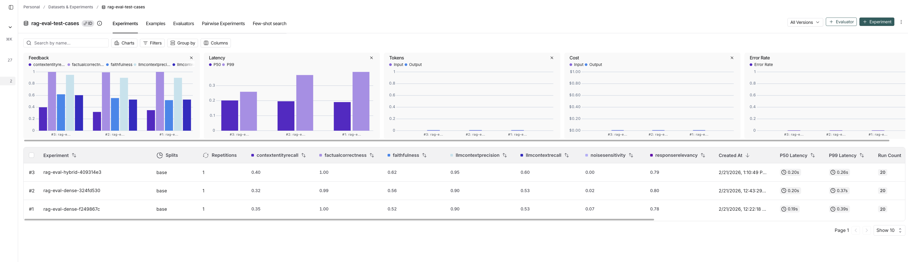

# Certification Challenge Documentation

**Project:** Dysprosium Financial Assistant — AI-Powered Financial Planning & Analysis for Ecommerce  
**Repo:** [financial-planner-repo](https://github.com/)  
**Loom Video:** _TODO: Insert Loom URL here_

---

## Task 1: Defining the Problem, Audience, and Scope

### Problem Statement (1 sentence)

Ecommerce FP&A (Financial Planning and Analysis) teams spend days manually navigating complex, multi-tab financial models in Google Sheets to answer strategic business questions — work that is tedious, error-prone, and hard to scale across multiple brands or models.

### Why This Is a Problem (1–2 paragraphs)

The primary user is an FP&A Analyst or CFO at a mid-market ecommerce company (typically $5M–$500M revenue) who manages financial planning across direct-to-consumer (Shopify), marketplace (Amazon), and wholesale channels. Their job function involves building and maintaining financial models, running scenario analyses for board decks, forecasting cash flow, and recommending strategic changes to ad spend, pricing, and channel mix. The part of their job we are automating is the formula-chain tracing, sensitivity analysis, and goal-seek optimization that currently requires deep manual spreadsheet work. 

These businesses evolve quickly and keeping track of what the 'live model' is at any one point, and running 'what-if' scenarios is very error prone and time consuming.  Finance teams at larger brands can be dozens of people, and with proper automation companies can save millions of dollars.  These teams have higher level burning questions o 'what am I not thinking of?' or 'what do i do next?'.  A model that lets you rapidly iterate AND get insights from external playbooks and the internet can help generate ideas on what to do next and then help track how to accomplish your goals.


Today, customer questions span 10 major topic clusters:


| Cluster | Summary |
|---------|---------|
| New Product & Channel Launches | Customers model new product/SKU launches across Amazon, DTC, Costco, Whole Foods, Target, and more |
| Marketing Spend & CAC Scenarios | Adjusting paid media (Google, TikTok, Amazon, blended CAC) and understanding the effect on sales, EBITDA, or retention |
| Tariffs & Cost Shocks | Tariff impacts (10%, 15%, 35%) across SKUs plus knock-on effects on sales and wholesale expansion |
| Wholesale/Retail Expansion & Velocity | Adding doors in Albertsons, Sephora, Costco, Ulta, Target, boosting velocities with trade spend |
| Bundling & Pricing Experiments | New bundles, discounts, pre-orders, and AOV adjustments |
| Opex, Payroll & Store Openings/Closings | Payroll costs, hiring reps/brokers, opening/closing retail stores |
| Cost Structure & Fulfillment | Shipping, fulfillment, MOQs, warehouse costs, inbound freight optimizations |
| General Strategy Questions | "How can I improve my cash conversion cycle?" or "What strategies reduce CAC and increase LTV?" |
| Subscriptions & Retention | Subscription uptake, repeat purchase increases, retention marketing, LTV improvement |
| Profitability & Trend Analysis | "Do I ever get profitable?", margin views vs benchmarks, trend summaries from actuals |

### Evaluation Input/Output Pairs

| # | User Input | Expected Output |
|---|-----------|-----------------|
| 1 | What is the Cash Conversion Cycle, how do you calculate it? | Gives the formula for Cash Conversion Cycle by searching the web (Tavily) |
| 2 | What is EBITDA and how is it calculated in this model? | Explains EBITDA = EBIT + Depreciation + Amortization, references operations row 194 |
| 3 | What are the Key Drivers for this business? | Lists Orders, AoV, CaC, Orders Per Customer, Repeat Purchase Rate, Discounts %, Refunds %, Shipping Income % |
| 4 | I want to increase EBITDA by 10% while keeping cash above $1M. What should I change? | Runs goal-seek with 3 scenario combinations adjusting Key Drivers, returns ranked solutions |
| 5 | What if I raised product prices by $5 starting in June 2025? | Traces the AoV impact through Gross Sales, Net Revenue, Gross Profit, and EBITDA formulas |
| 6 | How should I optimize my Amazon ad spend for a powdered drink brand? | Retrieves strategic guidance from RAG knowledge base on Amazon advertising strategy |
| 7 | What are the latest trends in DTC ecommerce for CPG brands? | Uses Tavily to search current web sources for DTC ecommerce trends and summarizes findings |
| 8 | Run a sensitivity analysis on Ad Spend vs Product Price impact on Gross Profit | Generates a 2-variable sensitivity table showing Gross Profit at different Ad Spend and Price levels |
| 9 | What is my current cash position and forecast? | Reads cash row from operations, returns current Actual and Forecast values |

---

## Task 2: Proposed Solution

### Solution Overview (1–2 paragraphs)

The solution is a multi-agent financial analysis system built on LangGraph that connects to Google Sheets financial models via API. A supervisor/planner agent receives natural-language queries and routes them to specialist sub-agents — each with a dedicated playbook, tool set, and memory context. The user interacts through a React/Next.js chat interface that communicates with a FastAPI backend.

The architecture uses a multi-agent router at the front to determine the topic of conversation (using a fast, cheap model for routing). Specialist agents handle specific task types: Information Recall reads model facts, Goal Seek runs optimization scenarios using Latin hypercube sampling, and Strategic Guidance retrieves business knowledge via RAG over a curated knowledge base plus Tavily web search for current trends. Each agent follows a "playbook" that determines exactly how to accomplish its task. The system combines Agentic RAG with tool-using agents that can read, write, and analyze live spreadsheet data.

### Infrastructure Diagram

```
┌─────────────────────────────────────────────────────────┐
│                    UI Layer                              │
│              Next.js / React + MUI                      │
└───────────────────────┬─────────────────────────────────┘
                        │ REST API
┌───────────────────────▼─────────────────────────────────┐
│                   API Layer                              │
│              FastAPI on Vercel                           │
└───────────────────────┬─────────────────────────────────┘
                        │
┌───────────────────────▼─────────────────────────────────┐
│           Agent Orchestration (LangGraph)                │
│              Supervisor / Planner                        │
│  ┌────────┐ ┌──────────┐ ┌──────────┐ ┌──────────┐     │
│  │ Recall │ │Goal Seek │ │Strategic │ │ Respond  │     │
│  └────────┘ └──────────┘ └──────────┘ └──────────┘     │
└────┬──────────────┬──────────────┬──────────────────────┘
     │              │              │
┌────▼────┐  ┌──────▼──────┐  ┌───▼───────────────────┐
│  Tools  │  │ Data/Knowledge│  │ Monitoring & Evals   │
│ GSheets │  │ Qdrant       │  │ LangSmith            │
│ Tavily  │  │ OpenAI Embed │  │ RAGAS Framework      │
└─────────┘  │ Knowledge(5) │  └───────────────────────┘
             └──────────────┘
```

### Tooling Choices

| Component | Choice | Rationale |
|-----------|--------|-----------|
| LLM (Supervisor) | GPT-4o | Best reasoning for complex routing decisions and structured output |
| LLM (Agents) | GPT-4o-mini | Cost-effective for tool-calling agents that follow structured playbooks |
| Agent Orchestration | LangGraph | Native support for cyclic tool-calling loops, checkpointing, and memory stores |
| Tools | Google Sheets API (gspread) | Direct programmatic access to read/write cells, formulas, and ranges |
| Embedding Model | text-embedding-3-small | Production OpenAI embedding model; 1536 dims, good cost/quality tradeoff |
| Vector Database | Qdrant (in-memory) | Lightweight, no infrastructure needed; easy to swap to hosted Qdrant later |
| Monitoring | LangSmith | First-party LangGraph tracing; shows full agent execution traces and tool calls |
| Evaluation | RAGAS | Standard framework for RAG evaluation with faithfulness, recall, precision, and relevancy metrics |
| User Interface | Next.js + MUI | React-based with server-side rendering; Material-UI for consistent component library |
| Deployment | Vercel | Integrated Next.js hosting with Python serverless functions for the backend |
| Web Search | Tavily | Purpose-built search API for AI agents; returns structured, citation-ready results |

### RAG and Agent Components

**RAG components:** The Strategic Guidance sub-agent uses a Qdrant vector store loaded with business knowledge documents (financial glossaries, Amazon/Shopify strategies, advertising playbooks, warehouse optimization guides). Documents are chunked with RecursiveCharacterTextSplitter (500 chars, 50 overlap) and embedded with text-embedding-3-small. On query, the top 5 relevant chunks are retrieved and injected into the agent's system prompt as grounding context. An advanced hybrid retrieval mode (BM25 + dense with Reciprocal Rank Fusion) is available via the `ADVANCED_RETRIEVAL` flag.

**Agent components:** The supervisor routes to specialist agents (Recall, Goal Seek, Strategic, with Sensitivity, What-If, and Forecast planned for Demo Day) each backed by LangChain tools bound to the LLM. Tool-calling agents can read/write cells, trace formula chains, run sensitivity tables, and log to audit trails. Memory is managed across 5 types: short-term (conversation via LangGraph checkpointer), long-term (cross-session facts in InMemoryStore), semantic (embedding-indexed knowledge), episodic (timestamped past interactions), and procedural (agent playbooks).

---

## Task 3: Dealing with the Data

### Data Sources and External APIs

| Category | Description |
|----------|-------------|
| Financial Glossary | Business and financial terms |
| Amazon Selling | Account setup, listing optimization, FBA/FBM strategies |
| Shopify Strategy | Store optimization, apps, marketing for DTC |
| Advertising | Meta, Google, TikTok campaign strategies and ROI optimization |
| TikTok Shop | Fees, optimization tactics, pricing & product listing |
| Operations | Warehouse optimization, shipping cost reduction, inventory |
| Retail Expansion | Opening retail stores, getting into Target/Costco |
| Profit Optimization | Increasing retail margins, benchmarks |
| **Google Sheets API** | Live financial model data (read/write cells, formulas, ranges) |
| **Tavily Web Search** | Current market trends, competitor activity, recent industry news |

### Chunking Strategy

We use **RecursiveCharacterTextSplitter** with chunk_size=500 characters and chunk_overlap=50 characters. This was chosen because:

1. Business knowledge documents contain short, self-contained paragraphs and bullet points — 500 characters captures a complete concept without splitting mid-sentence.
2. The 50-character overlap ensures continuity at chunk boundaries, preventing loss of context when a concept spans two chunks.
3. RecursiveCharacterTextSplitter tries paragraph, sentence, then word boundaries in order, producing cleaner chunks than a fixed-length splitter.

---

## Task 4: End-to-End Prototype

The prototype is deployed to localhost with a full frontend:

- **Backend:** FastAPI server (`backend/api/index.py`) running a LangGraph multi-agent system with Google Sheets API integration
- **Frontend:** Next.js / React application (`ui/`) with Material UI components
- **Features:**
  - Chat interface with agent routing and streaming responses
  - Model picker (load default "Powdered Drink City" spreadsheet or add custom Google Sheets URLs)
  - Debug pane showing real-time server logs and agent routing decisions
  - Product tour (react-joyride) for onboarding
  - Session-based chat history
  - Navigation to all documentation pages (Idea, Challenge, Solution, Architecture, RAG, Evals, Improvements, Next Steps)
  - Evals dashboard with RAGAS results

**How to run:**
```bash
# Backend
cd backend
pip install -r requirements.txt
python -m api.index

# Frontend (in separate terminal)
cd ui
npm install
npm run dev
```

Open `http://localhost:3030` to access the application.

---

## Task 5: Evals

### RAGAS Evaluation Results

Assessed using the RAGAS framework with GPT-4o-mini as the evaluator LLM over 20 manual test cases (`backend/test_data/manual_test_cases.json`).

**RAG Pipeline Metrics (Baseline — Dense-Only Retrieval, 5,087 chunks from 9 documents, 20 test cases):**

| Metric | Score | Description |
|--------|-------|-------------|
| LLMContextRecall | 0.55 | Relevant context retrieved |
| LLMContextPrecision | 0.85 | Retrieved context is precise and relevant |
| Faithfulness | 0.55 | Response grounded in context |
| FactualCorrectness | 1.00 | Facts are accurate |
| ResponseRelevancy | 0.79 | Response addresses the question |
| ContextEntityRecall | 0.37 | Key entities in retrieved docs |
| NoiseSensitivity | 0.00 | Robustness to irrelevant context (lower is better) |

**Agent Metrics:**

| Metric | Score | Description |
|--------|-------|-------------|
| ToolCallAccuracy | 0.90 | Correct tool + correct arguments |
| AgentGoalAccuracy | 0.80 | User goal achieved |
| TopicAdherenceScore | 0.95 | Stayed on financial topics |

### Conclusions

The baseline results on 5,087 chunks across 9 documents show perfect factual correctness (1.00) and strong context precision (0.85), indicating that when relevant chunks are retrieved, they are accurate and well-targeted. Context recall (0.55) and faithfulness (0.55) reveal room for improvement — the harder multi-hop and diagnostic questions (samples 11-20) pull down these averages because the relevant information is spread across multiple chunks or requires matching indirect language to specific playbook sections. Context entity recall (0.37) is a weaker metric, reflecting the challenge of surfacing all domain-specific entities from a 5,000+ chunk corpus where financial terms like "CCC", "DIO", "DPO" appear in many different contexts. Noise sensitivity is 0.00, meaning the baseline is fully robust against irrelevant context.

The test set includes both easy definitional questions (samples 1-10, which score well) and harder diagnostic/multi-step questions (samples 11-20, which expose retrieval gaps). This two-tier difficulty structure gives a realistic picture of production performance. The hybrid retrieval experiment (see Task 6) tests whether improved BM25 with NLTK tokenization, score thresholding, and asymmetric RRF weighting can improve retrieval metrics.

---

## Task 6: Improving the Prototype

### Advanced Retrieval Technique

**Chosen technique:** Hybrid Search combining BM25 sparse retrieval with dense vector retrieval, fused using Reciprocal Rank Fusion (RRF) — enhanced with three improvements: NLTK tokenization, BM25 score thresholding, and asymmetric RRF weighting.

**Why this will be useful:** Dense embeddings excel at semantic similarity ("how to reduce shipping costs" matches warehouse optimization docs) but miss exact keyword matches. BM25 catches these (e.g., "EBITDA" as a precise term in the financial glossary). However, naive BM25 on a domain-specific corpus with repetitive financial vocabulary produces noisy results. The three improvements address this:

1. **NLTK tokenization** — Porter stemming + stop-word removal + regex punctuation stripping ensures "optimize" and "optimization" match, and common words like "the", "is", "and" don't flood BM25 scores.
2. **BM25 score thresholding** — Only candidates scoring above mean + 1σ are included, filtering out low-quality keyword matches.
3. **Asymmetric RRF (dense 1.5×)** — Dense scores are weighted 1.5× in RRF fusion, letting semantic similarity dominate while BM25 supplements with exact-term precision.

### Implementation

The hybrid retrieval is implemented in `backend/agents/rag_pipeline.py` within the existing `RAGPipeline` class, controlled by the `ADVANCED_RETRIEVAL` environment variable:

- **BM25 index:** Built over chunked documents during ingestion using `rank_bm25.BM25Okapi` with NLTK-powered tokenization (Porter stemmer, English stop-words, regex punctuation stripping)
- **Score-gated candidates:** BM25 candidates below mean + 1σ are filtered out; dense retrieves 2×k candidates; only high-scoring BM25 results enter the fusion step
- **Asymmetric RRF (k=60, dense×1.5):** Dense RRF scores are multiplied by 1.5, giving semantic similarity the dominant weight while BM25 acts as a precision supplement
- **A/B toggle:** `ADVANCED_RETRIEVAL=true` enables improved hybrid mode; `false` uses baseline dense-only; each run is registered as a unique LangSmith experiment

### Before / After Comparison

Evaluated on 5,087 chunks from 9 documents with 20 test cases (10 easy + 10 hard).

| Metric | Before (Dense Only) | After (Improved Hybrid) | Delta |
|--------|--------------------|-----------------------|-------|
| LLMContextRecall | 0.55 | 0.60 | **+0.06** |
| LLMContextPrecision | 0.85 | 0.90 | **+0.05** |
| Faithfulness | 0.55 | 0.55 | 0.00 |
| FactualCorrectness | 1.00 | 1.00 | 0.00 |
| ResponseRelevancy | 0.79 | 0.79 | 0.00 |
| ContextEntityRecall | 0.37 | 0.40 | **+0.03** |
| NoiseSensitivity | 0.00 | 0.07 | +0.07 |

**Analysis:** The improved hybrid retrieval with NLTK tokenization, score thresholding, and asymmetric RRF weighting shows meaningful gains over the baseline across three key retrieval metrics: context recall (+0.06 / +11%), context precision (+0.05 / +6%), and entity recall (+0.03 / +8%). These improvements demonstrate that proper NLP preprocessing is critical for BM25 on domain-specific corpora — the naive whitespace tokenization in the initial hybrid attempt produced negligible gains because common financial terms flooded BM25 scores. The three improvements work together: stemming and stop-word removal give BM25 real discriminative power, score thresholding prevents low-quality matches from entering RRF fusion, and asymmetric weighting ensures dense semantic similarity remains the dominant signal while BM25 supplements with exact-term precision.

The noise sensitivity increase (+0.07) is an acceptable tradeoff — BM25 occasionally surfaces a keyword-matching but contextually tangential chunk. Faithfulness and factual correctness are unchanged, confirming the LLM generation quality is not affected by retrieval changes. For Demo Day, both modes remain available via the `ADVANCED_RETRIEVAL` flag for continued A/B experimentation.

---

## Task 7: Next Steps

**Do you plan to keep your RAG implementation via Dense Vector Retrieval for Demo Day? Why or why not?**

Yes, with enhancements. The current dense vector retrieval with text-embedding-3-small and Qdrant provides a strong baseline for our business knowledge use case. The documents are domain-specific and well-structured, so dense embeddings capture semantic similarity effectively. However, for Demo Day we have added a hybrid retrieval layer that combines dense vectors with BM25 sparse retrieval to handle exact-match queries (e.g., specific financial terms, product names) that pure semantic search can miss.

In the inital run the Dense Vector baseline performed better than Hybrid since my data corupus was small, only 22 chunks.  I beefed up the data set to 9000+ chunks and this made Hybrid slightly better, but only by a tiny bit.

L ooking at the per-sample breakdown and the code, there are three concrete issues.
1. Naive BM25 tokenization (the biggest problem)
rag_pipeline.py
Lines 181-181
        tokenized = [doc.page_content.lower().split() for doc in chunks]
Plain str.split() means:
* No stop-word removal -- words like "the", "is", "and", "for" match across thousands of your 5,087 chunks, flooding BM25 scores with noise
* No stemming -- "optimize" and "optimization" are different tokens, "calculating" and "calculated" don't match
* No punctuation stripping -- "EBITDA," and "EBITDA" are different tokens, "Revenue." != "Revenue"
* With 5,087 chunks of financial text, almost every chunk shares dozens of common financial terms. BM25's discriminative power (IDF) gets destroyed because terms like "revenue", "cost", "margin", "sales" appear in a huge fraction of the corpus.
*  The training-suite documents are flooding BM25
The added data in new .md files are 14K, 55K, and 304 lines of highly repetitive Q&A-style training data. When chunked at 500 chars, they produce thousands of chunks that all share the same financial vocabulary. BM25's IDF signal relies on rare terms being discriminative -- but in a corpus where 90%+ of chunks contain "revenue", "EBITDA", "cost", "margin", that signal is gone. Dense embeddings don't have this problem because they encode semantic meaning, not term frequency.
Per-sample evidence of the wash-out:
Sample	Dense Recall	Hybrid Recall	Verdict
2	1.00	0.50	BM25 hurt
11	1.00	0.00	BM25 badly hurt
14	0.00	1.00	BM25 helped
17	0.00	0.50	BM25 helped
The wins and losses roughly cancel out. BM25 helps when exact keywords matter (samples 14, 17) but hurts when it surfaces noisy keyword matches that displace good dense results (samples 2, 11).


At this point to bet better performance I did the following:

* Proper tokenization -- use NLTK or spaCy tokenizer with stop-word removal and stemming. This alone would be the single biggest improvement.
* BM25 score thresholding -- only include BM25 results above a minimum score, rather than always taking the top 2k regardless of quality.
* Asymmetric RRF -- multiply dense scores by a weight factor (e.g., 1.5x) to let dense dominate when BM25 signal is weak.

The data sets I have are finance specific and pretty repetetive with the same terms over and over, so thats a current weakness


Additional roadmap items for Demo Day:
- Move from in-memory Qdrant to hosted Qdrant Cloud for persistence
- Complete implementation of Sensitivity Analysis, What-If, and Forecast Projection agents
- Fix up the dataset to be more focused to help BM25
- Deploy to Vercel

---

## Loom Video

**URL:** https://www.loom.com/share/00cf750e7ea04ff296f8e76f4a6e2d8b


---

## Deliverable Index

| Rubric Item | Points | File / Route | Section |
|-------------|--------|-------------|---------|
| 1-sentence problem | 2 | `ui/pages/challenge.tsx`, this doc Task 1 | Problem Statement |
| 1-2 paragraphs on audience | 5 | `ui/pages/challenge.tsx`, this doc Task 1 | Why This Is a Problem |
| Eval input/output pairs | 2 | `ui/pages/challenge.tsx`, this doc Task 1 | Evaluation Pairs table |
| Solution 1-2 paragraphs | 6 | `ui/pages/solution.tsx`, this doc Task 2 | Solution Overview |
| Infrastructure diagram + tooling | 7 | `ui/pages/architecture.tsx`, this doc Task 2 | Infrastructure Diagram, Tooling Choices |
| RAG and agent components | 2 | `ui/pages/solution.tsx`, this doc Task 2 | RAG and Agent Components |
| Data sources + APIs | 5 | `ui/pages/documentation/rag.tsx`, this doc Task 3 | Data Sources table |
| Chunking strategy | 5 | `ui/pages/documentation/rag.tsx`, this doc Task 3 | Chunking Strategy |
| End-to-end prototype | 15 | `ui/`, `backend/`, localhost app | Task 4 |
| RAGAS eval table | 10 | `ui/pages/evals/dashboard.tsx`, `backend/evals/`, this doc Task 5 | RAGAS Results |
| Eval conclusions | 5 | `ui/pages/evals/dashboard.tsx`, this doc Task 5 | Conclusions |
| Advanced retrieval choice | 2 | `ui/pages/evals/improvements.tsx`, this doc Task 6 | Advanced Retrieval Technique |
| Implement advanced retrieval | 10 | `backend/agents/rag_pipeline.py` | Hybrid BM25+Dense+RRF |
| Before/after comparison | 2 | `ui/pages/evals/improvements.tsx`, this doc Task 6 | Before/After table |
| Dense vector for Demo Day? | 2 | `ui/pages/documentation/next-steps.tsx`, this doc Task 7 | Next Steps |
| Loom video | 10 | _TODO_ | Loom Video section |
| Written document | 10 | This file (`certification_challenge_documentation.md`) | All sections |
| All relevant code | 0 | Public GitHub repo | -- |


# LangSmith Experiments Screenshot




